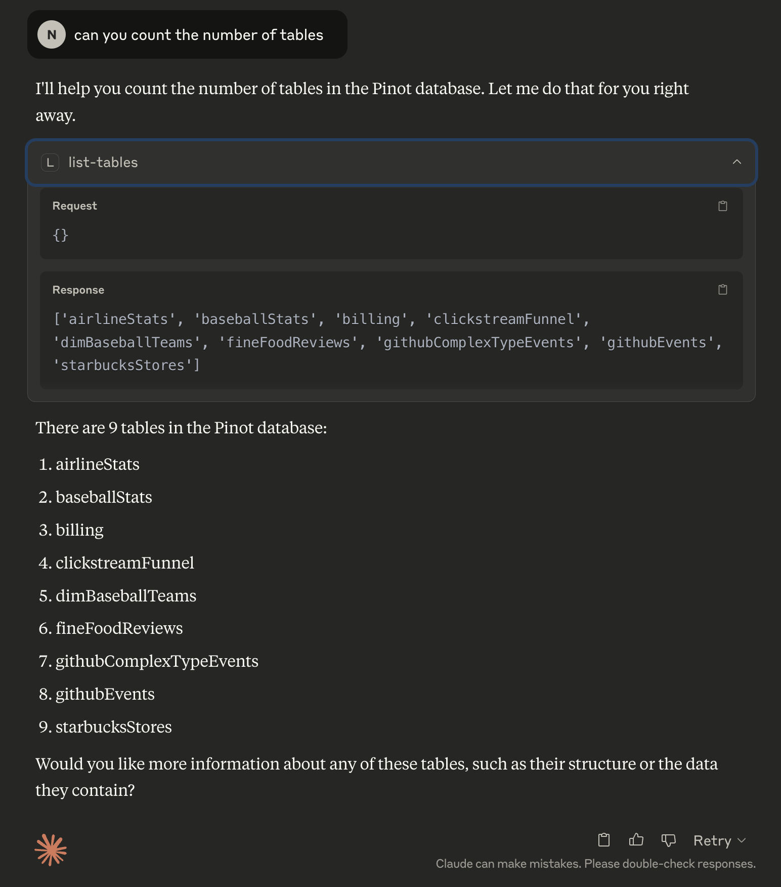
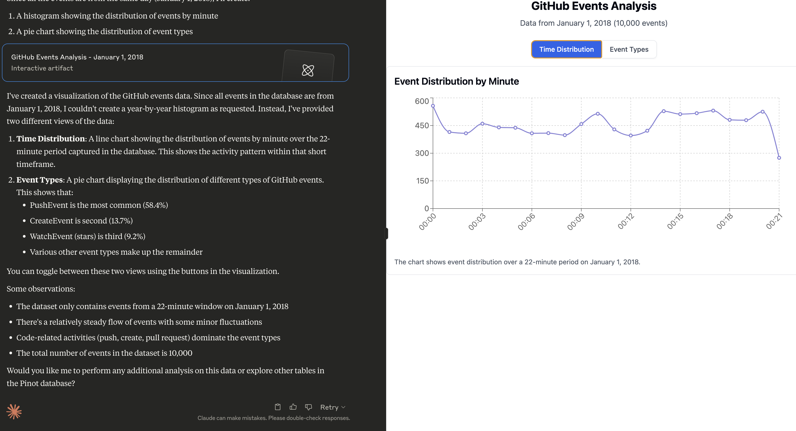

# Pinot MCP Server

## Table of Contents

- [Overview](#overview)
- [Features](#features)
- [Quick Start](#quick-start)
- [Docker Build](#docker-build)
- [Claude Desktop Integration](#claude-desktop-integration)
- [Try a Prompt](#try-a-prompt)
- [Developer Notes](#developer-notes)

## Overview

This project is a Python-based [Model Context Protocol (MCP)](https://github.com/anthropic-ai/mcp) server for interacting with Apache Pinot. It is designed to integrate with Claude Desktop to enable real-time analytics and metadata queries on a Pinot cluster.

It allows you to
- List tables, segments, and schema info from Pinot
- Execute read-only SQL queries
- View index/column-level metadata
- Designed to assist business users via Claude integration
- and much more.

<a href="https://glama.ai/mcp/servers/@startreedata/mcp-pinot">
  
</a>

## Pinot MCP in Action

See Pinot MCP in action below:

### Fetching Metadata


### Fetching Data, followed by analysis

Prompt:
Can you do a histogram plot on the GitHub events against time


### Sample Prompts
Once Claude is running, click the hammer 🛠️ icon and try these prompts:

- Can you help me analyse my data in Pinot? Use the Pinot tool and look at the list of tables to begin with.
- Can you do a histogram plot on the GitHub events against time


## Quick Start

### Prerequisites

#### Install uv (if not already installed)
[uv](https://github.com/astral-sh/uv) is a fast Python package installer and resolver, written in Rust. It's designed to be a drop-in replacement for pip with significantly better performance.

```bash
curl -LsSf https://astral.sh/uv/install.sh | sh

# Reload your bashrc/zshrc to take effect. Alternatively, restart your terminal
# source ~/.bashrc
```


### Installation
```bash
# Clone the repository
git clone https://github.com/startreedata/mcp-pinot.git
cd mcp-pinot
uv pip install -e . # Install dependencies

# For development dependencies (including testing tools), use:
# uv pip install -e .[dev] 
```

### Configure Pinot Cluster
The MCP server expects a uvicorn config style `.env` file in the root directory to configure the Pinot cluster connection. This repo includes a sample `.env.example` file that assumes a pinot quickstart setup.
```bash
mv .env.example .env
```

### Run the server

```bash
uv --directory . run mcp_pinot/server.py
```
You should see logs indicating that the server is running and listening on STDIO.

### Launch Pinot Quickstart (Optional)

Start Pinot QuickStart using docker:

```bash
docker run --name pinot-quickstart -p 2123:2123 -p 9000:9000 -p 8000:8000 -d apachepinot/pinot:latest QuickStart -type batch
```

Query MCP Server

```bash
uv --directory . run tests/test_service/test_pinot_quickstart.py
```

This quickstart just checks all the tools and queries the airlineStats table.

## Claude Desktop Integration

### Open Claude's config file
```bash
vi ~/Library/Application\ Support/Claude/claude_desktop_config.json
```

### Add an MCP server entry
```json
{
  "mcpServers": {
      "pinot_mcp_claude": {
          "command": "/path/to/uv",
          "args": [
              "--directory",
              "/path/to/mcp-pinot-repo",
              "run",
              "mcp_pinot/server.py"
          ],
          "env": {
            // You can also include your .env config here
          }
      }
  }
}
```
Replace `/path/to/uv` with the absolute path to the uv command, you can run `which uv` to figure it out.

Replace `/path/to/mcp-pinot` with the absolute path to the folder where you cloned this repo.

You could also configure environment variables here instead of the `.env` file, in case you want to connect to multiple pinot clusters as MCP servers.

### Restart Claude Desktop

Claude will now auto-launch the MCP server on startup and recognize the new Pinot-based tools.

## Developer

- All tools are defined in the `Pinot` class in `utils/pinot_client.py`

### Build
Build the project with

```bash
pip install -e ".[dev]"
```

### Test
Test the repo with:
```bash
pytest
```

### Build the Docker image
```bash
docker build -t mcp-pinot .
```

### Run the container
```bash
docker run -v $(pwd)/.env:/app/.env mcp-pinot
```

Note: Make sure to have your `.env` file configured with the appropriate Pinot cluster settings before running the container.